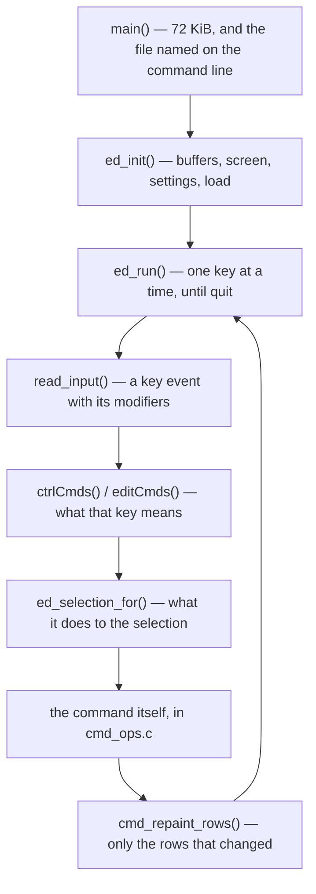
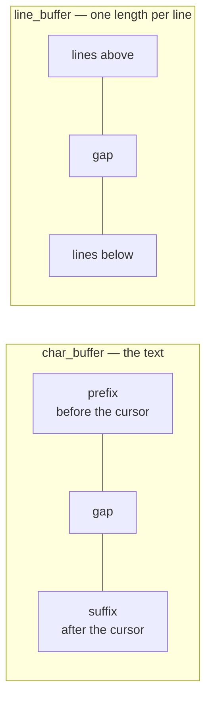
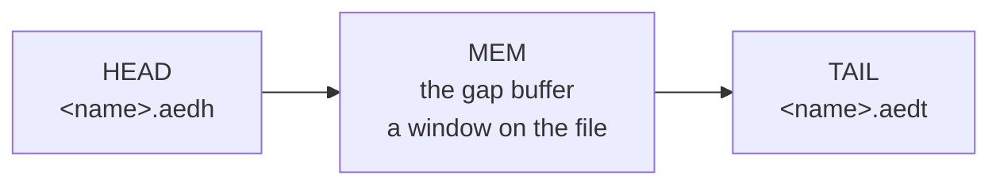

# How AED works

AED edits text on a machine with **512 KB of RAM, no cache, and a screen at the
far end of a serial link**. Those three facts explain most of the design; this
document describes the parts and how they fit together.

## Contents

* [1. The shape of a run](#1-the-shape-of-a-run)
* [2. Model, view, controller](#2-model-view-controller)
    * [2a. What the loop does before the command](#2a-what-the-loop-does-before-the-command)
* [3. The document in memory](#3-the-document-in-memory)
    * [3a. Line numbers](#3a-line-numbers)
* [4. A document bigger than memory](#4-a-document-bigger-than-memory)
    * [4a. What makes a file too large](#4a-what-makes-a-file-too-large)
* [5. Reading past the window](#5-reading-past-the-window)
* [6. Keys, and the screen](#6-keys-and-the-screen)
    * [6a. Keys](#6a-keys)
    * [6b. Painting](#6b-painting)
    * [6c. Colour](#6c-colour)
* [7. Selection, undo and the clipboard](#7-selection-undo-and-the-clipboard)
* [8. Settings, and fonts](#8-settings-and-fonts)
* [9. How it is checked](#9-how-it-is-checked)
* [10. Adding something](#10-adding-something)

Two subsystems have a document of their own, because each is a design rather
than a handful of functions:

* [**PAGING.md**](PAGING.md) — how a gap buffer edits a document larger than
  memory: the window, the two scratch files, what a slide must preserve, and
  the limits that fall out.
* [**COLOURING.md**](COLOURING.md) — syntax highlighting without a regular
  expression engine: the grammar format, the lexer, and the model that keeps a
  block comment coloured across a line break.

Sizing — how big the buffer is, how much of it stays empty, and why — is in
`.internal/docs/SIZING.md`, with the sweeps behind each number. A path under
`.internal/` is a working note rather than a published one: it holds the raw
sweeps and the discarded drafts, and it is not in the repository. Where one is
named here, what it would tell you is the measurement behind a number the text
already gives.

---

The editor is twenty-three files. Each has a header holding what the other parts
need from it, and the sections below follow them:

| file | what is in it | sections |
|---|---|---|
| [`main.c`](../src/main.c) | `main`, and the one number that sizes everything | 1 |
| [`editor.c`](../src/editor.c) | the key loop, what a key means, the selection | 1, 2, 7 |
| [`cmd_ops.c`](../src/cmd_ops.c) | one function per command, and the repaint | 2, 6 |
| [`text_buffer.c`](../src/text_buffer.c) | the document, and the six edits that change it | 3 |
| [`text_buffer_move.c`](../src/text_buffer_move.c) | the cursor: character, word, line, offset | 3 |
| [`text_buffer_page.c`](../src/text_buffer_page.c) | the window: settling, and the two slides | 4 |
| [`text_buffer_range.c`](../src/text_buffer_range.c) | positions, and the spans between them | 5 |
| [`text_buffer_find.c`](../src/text_buffer_find.c) | searching, including the part on disk | 5 |
| [`text_buffer_io.c`](../src/text_buffer_io.c) | reading files in and writing them back | 4, 5 |
| [`char_buffer.c`](../src/char_buffer.c) | the gap buffer itself | 3 |
| [`line_buffer.c`](../src/line_buffer.c) | the line index, a gap buffer of lengths | 3 |
| [`doc_store.c`](../src/doc_store.c) | the two scratch files a paged document lives in | 4 |
| [`screen.c`](../src/screen.c) | the VDP: geometry, colours, cursor, painting | 6 |
| [`lexer.c`](../src/lexer.c) | a grammar, and one row of text divided into runs | 6 |
| [`theme.c`](../src/theme.c) | a theme, and what a scope name collapses onto | 6 |
| [`user_input.c`](../src/user_input.c) | prompts, dialogs, the help screen, settings | 2, 8 |
| [`keys.c`](../src/keys.c) | key events, from the packet MOS hands over | 6 |
| [`undo.c`](../src/undo.c) | the record log | 7 |
| [`clipboard.c`](../src/clipboard.c) | copy, cut, paste, and spilling to a file | 7 |
| [`config.c`](../src/config.c) | the settings file | 8 |
| [`ini.c`](../src/ini.c) | the INI reader the settings, grammars and themes share | 8 |
| [`bootfont.c`](../src/bootfont.c) | which font the machine booted into | 8 |
| [`conv.c`](../src/conv.c) | character conversions | — |

The six `text_buffer` files are one module. What they share with each other is
in [`text_buffer_int.h`](../src/text_buffer_int.h), and carries a `tbi_` prefix
so that a call site says which it is: a `tb_` name is something the rest of the
editor may call, a `tbi_` name is one of those six talking to another.

[`ftrunc.asm`](../src/ftrunc.asm) is seven lines of assembly, because the fault
it works around is in a calling sequence that C cannot reach.

There is no global state. Everything hangs off one
[`editor`](../src/editor.h#L32), which `main` owns and passes down by address;
nothing reaches it any other way.

It is a `static` local rather than an ordinary one, which is a placement rather
than a change of ownership -- no other translation unit can name it. The editor
is most of a kilobyte, and `(IX + d)` addresses a frame with a signed byte, so
on the stack it put every other local in `main` past the boundary and cost the
two frame escapes the build used to carry. The heap and the stack grow toward
each other out of one region (`__stack` is `___heaptop`), so moving it from one
to the other costs no memory: `.bss` grew 776 bytes and the stack stopped
needing 825.

---

## 1. The shape of a run

[`main()`](../src/main.c#L25) ·
[`ed_init()`](../src/editor.c#L220) ·
[`ed_run()`](../src/editor.c#L536) ·
[`read_input()`](../src/editor.c#L771) ·
[`ctrlCmds()`](../src/editor.c#L627) ·
[`editCmds()`](../src/editor.c#L722) ·
[`ed_selection_for()`](../src/editor.c#L408) ·
[`cmd_repaint_rows()`](../src/cmd_ops.c#L828)

`main` asks for **72 KiB** — [`AED_DOC_KB`](../src/editor.h#L127) — and that
single number sizes the document: `tb_init` splits it into 71,424 bytes of
character buffer and 2,304 index slots, about one slot per 31 bytes. Nothing
else in the editor picks a size.

It is 72 KiB rather than as much as the heap allows because the document no
longer has to hold the file. What memory buys now is how far the cursor can
travel before a slide, and the sweeps behind that number are in
`.internal/docs/SIZING.md`.

---

## 2. Model, view, controller

The split is real and worth keeping:

* **`text_buffer`** is the document. It knows nothing about the screen. Every
  position it deals in is a [`tb_pos`](../src/text_buffer.h) — a line of the
  *document* and a column — and it repaints nothing.
* **`screen`** is the VDP. It knows nothing about the document. It is told what
  to paint and where.
* **`cmd_ops.c`** is the controller, and it is where the two meet. One function
  per command, each taking the whole `editor`.

The two worst bugs the project has had lived in that meeting rather than in
either side, which is why the host tests drive whole commands as well as the
model.

A key becomes a command in one of two tables —
[`ctrlCmds()`](../src/editor.c#L627) for a key with CTRL held,
[`editCmds()`](../src/editor.c#L722) for one without — and both are exported so
a test can assert a binding. **A command nothing can reach is not a feature; a
command that is reachable and does the wrong thing is worse.**

### 2a. What the loop does before the command

[`ed_selection_for()`](../src/editor.c#L408) decides what a keystroke does to
the selection *before* the command runs. Most keys end a selection; a few own it
and manage it themselves — copy, cut, paste, select-all, and all three find
commands.

That list is load-bearing. Find leaves its match selected and the next search
measures from where that selection starts, so dropping it here left CTRL+P
searching back from the cursor — which is at the *end* of the match it is
standing on, so it found the same one again and appeared to do nothing.

---

## 3. The document in memory

Two gap buffers, side by side.

[`char_buffer`](../src/char_buffer.h#L42) holds the bytes with a gap at the
cursor, so typing is a write into the gap rather than a move of everything after
it. It also keeps free space at *both ends*, which is what makes the four ends
below cheap: without it, taking a chunk off one end closed that whole side up
against the buffer, and every 2 KB slide moved a quarter of a megabyte.
[`line_buffer`](../src/line_buffer.h#L25) is the same shape holding the
*length of each line*, gap at the cursor's line, so a line number is a count of
entries rather than a scan for line feeds.

Both carry the line break in the length. `line_len` subtracts it, except on the
last line of the document, which has no break after it.

**Every break in a document is the same length**, and the document says which:
[`elen_`](../src/text_buffer.h#L69) is 2 for a file of CRLFs and 1 for a file of
bare line feeds. Every piece of line arithmetic subtracts that, and `tb_newline`
writes it. A file whose breaks are all of one kind is held exactly as it
arrived, so saving it gives the file back byte for byte and no conversion
happens at either end. A file with both kinds is normalised to CRLF on the way
in, which is the one case that costs a pass and the one case that opens dirty.

Both buffers have the same four ends — take and give, at the front and at the
back — which is what section 4 slides a window with. On the character buffer
they are pointer moves, and the free space they eat at one end and make at the
other is evened up when a side runs dry: one move of the live bytes, in place of
one per slide.

A quarter of the buffer is kept free for that, which is also what keeps the gap
wide enough for a walker. A copy walking the document moves the gap as it goes,
and that stays safe for the cursor that owns the buffer only while the gap is
wider than the distance the copy has travelled.

### 3a. Line numbers

A [`tb_pos`](../src/text_buffer.h) is a line of the **document**. When the whole
document is in memory that is the same as a line of the buffer, and when it is
not, two counters make up the difference:

    tb_ypos  =  head_lines_ + (lines above the cursor in memory) + 1
    tb_ymax  =  head_lines_ + (lines in memory) + tail_lines_

Both are maintained by the slides, so neither needs a scan. Getting this wrong
is subtle and quiet — a line number that is one out reads a neighbouring line
and looks almost right — so it was built and tested before there was anything on
disk to count, with `tb_set_offscreen` as the seam.

---

## 4. A document bigger than memory

What does not fit sits in two scratch files either side of what does.
[`doc_store`](../src/doc_store.h#L69) owns them and offers four operations —
push and pop, at each end — plus reads for saving.

**Text is never edited on disk.** It is only pushed and popped at the end facing
memory, which is the property the whole design rests on: the store never has to
find anything, only hand back what it was given last.

The window moves in [`TB_CHUNK`](../src/text_buffer.h#L51) of 2 KB, whole lines
only, driven by [`TB_MARGIN`](../src/text_buffer.h#L52) of 16 KB either side.
[`tb_settle()`](../src/text_buffer_page.c#L125) notices a margin has been crossed and
slides until it has not: [`tb_slide_down()`](../src/text_buffer_page.c#L418) sends
the front of memory to HEAD and takes a chunk from TAIL, and
[`tb_slide_up()`](../src/text_buffer_page.c#L582) is the exact reverse.

Everything that moves the cursor settles —
[`tb_seek`](../src/text_buffer_range.c#L64), and `tb_up` and `tb_down` too, so the
arrow keys and page up and down reach the whole document rather than the window.
A read-only copy is the exception, for the reason section 5 gives.

**Settling picks one direction and holds it for the whole call.** Each side used
to be asked about its margin on its own, which is enough only while a window is
several margins wide — and it is not always. The index holds one slot per 32
bytes of buffer, so a document of ten-byte lines fills the index at 23,040 bytes
and the window is *narrower than the two margins together*, whatever the
buffer's size. Both sides are then under their margin at once and always will
be, and asking them
separately made settling slide up, slide down, and undo itself until its guard
ran out: ten slides a keystroke with the window exactly where it started. Worse,
the pair leaked — a slide up put one line in TAIL, a slide down then saw
something there and evicted a whole chunk against it, and 2,030 bytes left the
window a turn. A cursor walking up a 20,000 line document stopped at the top of
the window with the other 184,640 bytes in HEAD and no way back to them.

So **the index bounds the window before the buffer does, whenever lines are
short**, and everything about paging has to hold at that size rather than at the
buffer's.

TAIL carries [`STORE_HEADROOM`](../src/doc_store.h#L67) of dead space in front
of it so text pushed back has somewhere to go. That space is written out at
open, because on this platform seeking past the end of a file and writing there
lands the write at the end instead — which would put the document a headroom too
early and lose that much off its far end.

The store holds both files open for as long as the document is open. Opening one
costs 1.12 centiseconds on MOS 3.0.2, and a slide does two of them against less
than a millisecond for the 2 KB it actually moves.

Every number in this section — the 72 KiB the editor starts with, the quarter
of the buffer kept free, the chunk and the margin — was picked against a
measurement. `.internal/docs/SIZING.md` has the sweep they came out of, what
each one is protecting, and what a second open document would cost.

[`PAGING.md`](PAGING.md) is the whole of it: each direction of a slide and the
asymmetries that are not obvious, the four invariants a slide must not break
with the bug that found each, why the line index bounds the window before the
buffer does, and where every limit comes from.

### 4a. What makes a file too large

Its longest line, rather than its size: a slide moves whole lines and carries a
chunk at most, so a line longer than `TB_CHUNK` can never be brought in. That is
2 KB, against a 72 KiB window — a line of 5,000 characters is refused although it
would fit in memory many times over.
[`tb_open`](../src/text_buffer_io.c#L633) reads the front of the file and refuses
before discarding what is on screen, and
[`tb_load`](../src/text_buffer_io.c#L472) has nothing to lose so it catches the
case after the load — nothing in memory with a document in the store is an
unreachable document rather than an open one.

The 8 MB ceiling is arithmetic. `objsize` is 32 bits and this machine's `int` is
24, so a larger file narrows to a small or negative number and walks past a
signed comparison.

---

## 5. Reading past the window

A `tb_copy` walker shares the original's buffers, so it must not slide — moving
the window under the cursor that owns it would turn a repaint into a scroll.
Painting uses walkers, and painting only ever wants what is on screen.

**A walker owns nothing.** Its two buffers are the original's allocations and
its store is the same store, so everything that would write to those refuses on
the walker flag: the edits, the slides, saving, loading, clearing, and
`tb_destroy`, which would otherwise hand the original's memory back while the
cursor that owns it is still reading. Every walker in the editor is a local that
goes out of scope, so the last of those has never been called on one — it is
guarded because it fails as memory corruption rather than as a wrong answer.

Everything else that has to see text outside the window **streams the document**.
[`tbi_doc_stream()`](../src/text_buffer_io.c#L780) walks HEAD, then memory, then what
is left of TAIL, feeding a sink. It reads only: the window stays where it is and
so does the cursor, so a caller can stream the document and carry on.

Four callers:

| | |
|---|---|
| saving | the sink writes what it is given, breaks and all |
| [`tb_find`](../src/text_buffer_find.c#L415) | Knuth–Morris–Pratt, one pass, answering forwards and backwards at once |
| [`tb_range_size`](../src/text_buffer_range.c#L344) | counts the bytes in a range |
| [`tb_range_walk`](../src/text_buffer_range.c#L373) | feeds them somewhere |

The last two share one pass, which is what stops them disagreeing about what a
range is — they once did, and a select-all copy returned 37% of a document with
nothing noticing.

Ranges stream **whatever the document's size**. The in-memory walk they replaced
was wrong on ordinary files too, and its answer depended on where the cursor
happened to be sitting.

Deleting a range is the exception. It is a mutation, so it settles as it goes.

---

## 6. Keys, and the screen

The two ends of the serial link, and both are shaped by it.

### 6a. Keys

[`keys_wait()`](../src/keys.c#L75) reads key *events* from the queue MOS fills
from the VDP's keyboard packet. `getch()` would return typed characters instead,
and a chord like `CTRL+SHIFT+RIGHT` produces none — a program blocked in it
sleeps through the chord entirely.

Each event carries its modifiers, measured when the key went down, which also
removes a race: reading the modifier sysvar afterwards can find it already
released.

[`test/probes/chords.c`](../test/probes/chords.c) prints what a chord actually
delivers, and is the first thing to reach for when a key "does nothing" — it
separates *the key never arrived* from *the editor did the wrong thing with it*.

### 6b. Painting

Every byte painted goes down the UART, which makes a full repaint the most
expensive thing the editor can do. So it paints rows:
[`cmd_repaint_rows()`](../src/cmd_ops.c#L828) takes a range, and most commands
pass a single row.

[`screen`](../src/screen.h#L57) derives its geometry from the font's cell size,
so a font of a different height changes the number of rows without anything else
knowing. `scr_clear` moves the cursor's row to the top of the text area as a
side effect, which has caused three separate bugs; it is more than paint.

### 6c. Colour

A colour change is two bytes on the same wire, so the number of them matters as
much as the number of characters. A row is painted as **runs** — a class and the
column it ends at — rather than a colour per column.

**The screen asks; nothing pushes.** The screen is handed a callback once, at
startup, and every path that paints a row asks it at paint time. The first
version had each of a dozen paint sites work the colours out and hand them over,
and the ones that forgot painted plainly with nothing to say they had. Asking is
inside the painting now, so a row cannot be painted without the question being
asked — which is what stops a thirteenth paint site being added silently.

What the answer needs is what the line begins inside, and only a grammar with a
construct that crosses a line break needs even that. The model holding it is
keyed by **document line**, not by screen row: a line begins inside what it
begins inside, and which row it is drawn on has nothing to do with that.

Grammars are read from `/config/aed/syntax`, themes from
`/config/aed/themes`, and the background in force picks the theme — a colour
that reads well on black is unreadable on white. **A theme is a view of a
document rather than a setting**: it moves the active colour pair only, and what
the reader chose is what the settings file keeps.

[`COLOURING.md`](COLOURING.md) is the whole of it: the grammar format and why it
is not regular expressions, the lexer, the model, and what the inversion cost
and bought.

---

## 7. Selection, undo and the clipboard

The three pieces of state that live alongside the document.

**The selection** is an anchor and the cursor, with no mode to leave. It starts
where the cursor was when SHIFT was first held, and any key that is not a
movement ends it — except the ones in section 2a that own it.

**Undo** is a log of [`undo_rec`](../src/undo.h#L61): an operation, a position,
and a run of text in one shared arena. Records merge while they are adjacent, so
a typed word is one record rather than five. Positions are absolute document
lines, which is what lets them survive the window moving underneath them.

**The clipboard** holds a copy in memory and **spills to a file** when it will
not fit, so a select-all on a large document can still be copied.
`clip_spill_would_overwrite()` asks before writing over something of yours. It
is session state rather than document state, so it outlives an `open` and
copying between files works.

---

## 8. Settings, and fonts

[`config.c`](../src/config.c) reads and writes an INI file. Sections and keys it
does not recognise are skipped and preserved, so the file stays readable by
older and newer versions alike.

Fonts are the awkward part. The VDP's font API arrived in Console8 VDP 2.8.0 and
MOS cannot report the VDP version, so **uncommenting the setting is the
declaration that yours has it** — on an older VDP the uploaded bitmap is read as
commands. [`bootfont.c`](../src/bootfont.c) reads `autoexec.txt` to find which
font the machine booted into, so exiting can put that one back rather than
dropping the machine to the stock 8x8.

---

## 9. How it is checked

| | |
|---|---|
| [`test/run.sh`](../test/run.sh) | the host suite: the real `src/*.c` against stub Agon headers, natively, under ASan and UBSan |
| [`test/frames.sh`](../test/frames.sh) | stack frames against the `(IX+d)` limit, read from the generated assembly |
| [`test/docs.sh`](../test/docs.sh) | that these documents still point at what they name, including the `#L` links into the sources. `--fix` repoints them |
| [`test/fonts.sh`](../test/fonts.sh) | the shipped fonts, whose height is their file size |
| [`test/build_deps.sh`](../test/build_deps.sh) | that the build tracks header dependencies |
| [`test/bench/`](../test/bench/) | the CPU-bound paths, on the emulator at the real clock |
| [`test/probes/`](../test/probes/) | questions only the machine can answer, run by hand |

`./test/run.sh <name>` runs one test. The whole suite is about nineteen seconds
for some 2,600 checks, and staying quick is deliberate: it was forty once, and a
suite that is run less often finds less.

**Mutation testing is the primary defence.** A test that passes against a
deliberately broken line is not testing that line. Several of the bugs recorded
in this document were found that way, and several tests exist only because a
mutant survived the first version of them.

Four things learned the hard way:

* **Check the exit status, and not only the FAIL lines.** A sanitiser abort
  prints no FAIL line at all, so counting them scores a crash as a survivor.
  Filtering the output to look at one thing hides the rest the same way: a
  `grep -v` over link rot once carried six rotted documentation links through a
  whole pull request, reported as green.
* **An oracle should be something other than a second implementation.** A
  differential test of the range operations against the in-memory ones was tried
  first and does not work, because those were themselves wrong. The tests work
  their answers out from prefix sums.
* **A test should go through the path a key takes.** CTRL+P had a passing test
  that called the command directly, while the loop cleared the state that
  command needed. Both of the bugs in section 2a were like this.
* **The host does not predict the target.** It is biased rather than noisy, and
  in the direction that flatters the work. Correctness on the host, speed on the
  emulator, and anything touching MOS on the emulator or the machine.

---

## 10. Adding something

* **Something on the document** goes in the `text_buffer_*.c` whose job it is,
  and anything two of them need goes in `text_buffer_int.h` with a `tbi_` name.
* **A command** needs a function in `cmd_ops.c`, a declaration in `cmd_ops.h`, a
  case in [`ctrlCmds()`](../src/editor.c#L627) or
  [`editCmds()`](../src/editor.c#L722), a row in the help table in
  `user_input.c`, a line in the README, and a test that goes through the *table*
  and the loop rather than calling the function.
* **If it moves the cursor**, it seeks. Stepping is for moving by one.
* **If it reads a range**, it streams. There has been one wrong second walk over
  the document already.
* **If it owns the selection**, say so in
  [`owns_selection()`](../src/editor.c#L393), or the loop will take the
  selection away before the command runs.
* **Anything on a hot path** is measured on the emulator before and after.
* **If it moves code any document links to**, run `./test/docs.sh --fix`. A
  `#L` link rots whenever anything above it moves, which is most commits, and
  the number is derived from the symbol the link names -- so it is the tool's to
  maintain rather than yours. What `--fix` will not do is guess: a link naming
  something that has been renamed or deleted fails, because only a person knows
  what was meant.
