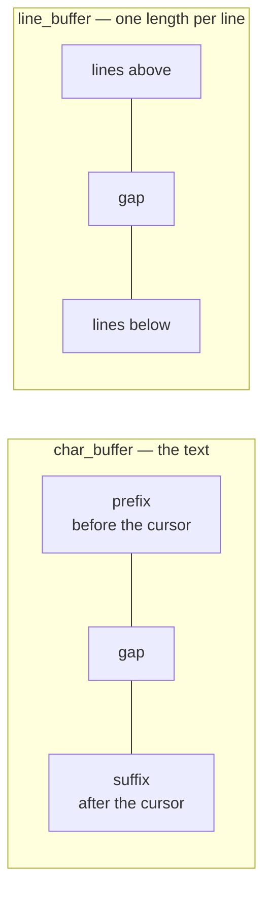
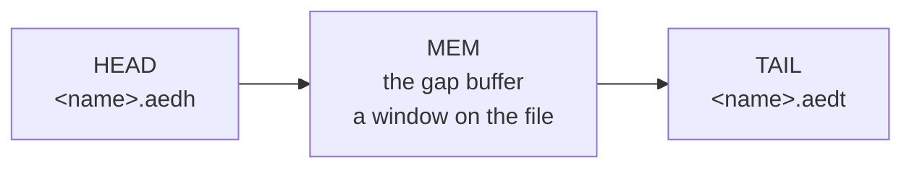

# How AED works

AED edits text on a machine with **512 KB of RAM, no cache, and a screen at the
far end of a serial link**. Those three facts explain most of the design; this
document describes the parts and how they fit together.

The editor is fifteen files. Each has a header holding what the other parts need
from it, and the sections below follow them:

| file | what is in it | sections |
|---|---|---|
| [`main.c`](../src/main.c) | `main`, and the one number that sizes everything | 1 |
| [`editor.c`](../src/editor.c) | the key loop, what a key means, the selection | 1, 2, 9 |
| [`cmd_ops.c`](../src/cmd_ops.c) | one function per command, and the repaint | 2, 8 |
| [`text_buffer.c`](../src/text_buffer.c) | the document: gap buffer, line index, paging | 3, 4, 5, 6 |
| [`char_buffer.c`](../src/char_buffer.c) | the gap buffer itself | 3 |
| [`line_buffer.c`](../src/line_buffer.c) | the line index, a gap buffer of lengths | 3 |
| [`doc_store.c`](../src/doc_store.c) | the two scratch files a paged document lives in | 5 |
| [`screen.c`](../src/screen.c) | the VDP: geometry, colours, cursor, painting | 8 |
| [`user_input.c`](../src/user_input.c) | prompts, dialogs, the help screen, settings | 2 |
| [`keys.c`](../src/keys.c) | key events, from the packet MOS hands over | 7 |
| [`undo.c`](../src/undo.c) | the record log | 10 |
| [`clipboard.c`](../src/clipboard.c) | copy, cut, paste, and spilling to a file | 11 |
| [`config.c`](../src/config.c) | the settings file | 12 |
| [`bootfont.c`](../src/bootfont.c) | which font the machine booted into | 12 |
| [`conv.c`](../src/conv.c) | character conversions | — |

[`ftrunc.asm`](../src/ftrunc.asm) is seven lines of assembly, and section 13
says why it has to be.

There is no global state. Everything hangs off one
[`editor`](../src/editor.h#L32), which `main` puts on the stack and passes down.

---

## 1. The shape of a run

[`main()`](../src/main.c#L25) ·
[`ed_init()`](../src/editor.c#L75) ·
[`ed_run()`](../src/editor.c#L370) ·
[`read_input()`](../src/editor.c#L604) ·
[`ctrlCmds()`](../src/editor.c#L460) ·
[`editCmds()`](../src/editor.c#L555) ·
[`ed_selection_for()`](../src/editor.c#L242) ·
[`cmd_repaint_rows()`](../src/cmd_ops.c#L257)

`main` asks for **256 KB** and that single number sizes the document: `tb_init`
splits it into a character buffer and a line index, one index slot per 32 bytes
of buffer. Nothing else in the editor picks a size.

---

## 2. Model, view, controller

The split is real and worth keeping:

* **`text_buffer`** is the document. It knows nothing about the screen. Every
  position it deals in is a [`tb_pos`](../src/text_buffer.h) — a line of the
  *document* and a column — and it never repaints anything.
* **`screen`** is the VDP. It knows nothing about the document. It is told what
  to paint and where.
* **`cmd_ops.c`** is the controller, and it is where the two meet. One function
  per command, each taking the whole `editor`.

The two worst bugs the project has had lived in that meeting, not in either
side, which is why the host tests drive whole commands rather than only the
model.

A key becomes a command in one of two tables —
[`ctrlCmds()`](../src/editor.c#L460) for a key with CTRL held,
[`editCmds()`](../src/editor.c#L555) for one without — and both are exported so
a test can assert a binding. **A command nothing can reach is not a feature; a
command that is reachable and does the wrong thing is worse.**

### 2a. What the loop does before the command

[`ed_selection_for()`](../src/editor.c#L242) decides what a keystroke does to
the selection *before* the command runs. Most keys end a selection; a few own
it and manage it themselves — copy, cut, paste, select-all, and all three find
commands.

That list is load-bearing. Find leaves its match selected and the next search
measures from where that selection starts, so dropping it here left CTRL+P
searching back from the cursor — which is at the *end* of the match it is
standing on, so it found the same one again and appeared to do nothing.

---

## 3. The document in memory

Two gap buffers, side by side.

[`char_buffer`](../src/char_buffer.h#L25) holds the bytes with a gap at the
cursor, so typing is a write into the gap rather than a move of everything
after it. [`line_buffer`](../src/line_buffer.h#L25) is the same shape holding
the *length of each line*, gap at the cursor's line, so a line number is a
count of entries rather than a scan for line feeds.

Both carry the CRLF in the length. `line_len` subtracts the two, except on the
last line of the document, which has no break after it.

**Every break in the document is a CRLF**, whatever the file had. The loader
converts on the way in, everything else goes through `tb_newline`, and
[`tb_save`](../src/text_buffer.c#L2654) converts back on the way out if the
file arrived with bare line feeds. Several things depend on that invariant.

Both buffers have the same four ends — take and give, at the front and at the
back — which is what section 5 slides a window with.

---

## 4. Line numbers

A [`tb_pos`](../src/text_buffer.h) is a line of the **document**, not of what is
in memory. When the whole document is in memory those are the same thing, and
when it is not, two counters make up the difference:

    tb_ypos  =  head_lines_ + (lines above the cursor in memory) + 1
    tb_ymax  =  head_lines_ + (lines in memory) + tail_lines_

Both are maintained by the slides, so neither needs a scan. Getting this wrong
is subtle and quiet — a line number that is one out reads a neighbouring line
and looks almost right — so it was built and tested before there was anything
on disk to count, with `tb_set_offscreen` as the seam.

---

## 5. A document bigger than memory

What does not fit sits in two scratch files either side of what does.
[`doc_store`](../src/doc_store.h#L68) owns them and offers four operations —
push and pop, at each end — plus reads for saving.

**Text is never edited on disk.** It is only pushed and popped at the end facing
memory, which is the property the whole design rests on: the store never has to
find anything, only to hand back what it was given last.

The window moves in [`TB_CHUNK`](../src/text_buffer.h#L59) of 2 KB, whole lines
only, driven by [`TB_MARGIN`](../src/text_buffer.h#L60) of 16 KB either side.
[`tb_settle()`](../src/text_buffer.c#L894) is what notices a margin has been
crossed and slides until it has not:
[`tb_slide_down()`](../src/text_buffer.c#L1054) sends the front of memory to
HEAD and takes a chunk from TAIL;
[`tb_slide_up()`](../src/text_buffer.c#L1157) is the exact reverse.

Everything that moves the cursor settles: [`tb_seek`](../src/text_buffer.c#L1282)
and also `tb_up` and `tb_down`, so the arrow keys and page up and down reach the
whole document rather than the window. **A read-only copy does not** — see
section 6.

TAIL carries [`STORE_HEADROOM`](../src/doc_store.h#L66) of dead space in front
of it so text pushed back has somewhere to go. It is *written*, not seeked past,
for a reason section 13 explains.

### 5a. What makes a file too large

Not its size. A line longer than the window, because a slide moves whole lines
and there is no whole line to move. [`tb_open`](../src/text_buffer.c#L2277) reads the
front of the file and refuses before discarding what is on screen;
[`tb_load`](../src/text_buffer.c#L2148) has nothing to lose and catches it after
the load — nothing in memory with a document in the store is an unreachable
document, not an open one.

The 8 MB ceiling is arithmetic: `objsize` is 32 bits and this machine's `int` is
24, so a larger file narrows to a small or negative number and walks past a
signed comparison.

---

## 6. Reading past the window

A `tb_copy` walker shares the original's buffers, so it must not slide — moving
the window under the cursor that owns it would be a repaint that scrolls the
document. Painting uses walkers, and painting only ever wants what is on screen.

Everything else that has to see text outside the window **streams the document**
instead. [`doc_stream()`](../src/text_buffer.c#L2548) walks HEAD, then memory,
then what is left of TAIL, feeding a sink. It reads only: the window does not
move and neither does the cursor.

Four callers:

| | |
|---|---|
| saving | a converting sink puts the line endings back |
| [`tb_find`](../src/text_buffer.c#L581) | Knuth–Morris–Pratt, one pass, answering forwards and backwards at once |
| [`tb_range_size`](../src/text_buffer.c#L1551) | counts the bytes in a range |
| [`tb_range_walk`](../src/text_buffer.c#L1580) | feeds them somewhere |

The last two share one pass, which is what stops them disagreeing about what a
range is — they once did, and a select-all copy returned 37% of a document with
nothing noticing.

Ranges stream **whatever the document's size**. The in-memory walk they replaced
was wrong on ordinary files too, and its answer depended on where the cursor was
sitting.

Deleting a range is the exception: it is a mutation, so it settles as it goes
rather than streaming.

---

## 7. Keys

Not `getch()`. That returns typed *characters*, and a chord like
`CTRL+SHIFT+RIGHT` does not produce one, so a program blocked in it sleeps
through the chord entirely.

[`keys_wait()`](../src/keys.c#L75) reads key *events* from the queue MOS fills
from the VDP's keyboard packet. Each carries its modifiers, measured when the
key went down — which also removes a race, since the old code read the modifier
sysvar afterwards, by which time it could have been released.

[`test/probes/chords.c`](../test/probes/chords.c) prints what a chord actually
delivers. It is the first thing to reach for when a key "does nothing": it
separates *the key never arrived* from *the editor did the wrong thing with it*.

---

## 8. Painting

The link to the VDP is a UART, and every byte painted goes down it. Repainting
the screen is the most expensive thing the editor can do, so it does not:
[`cmd_repaint_rows()`](../src/cmd_ops.c#L257) paints a range of rows, and most
commands paint one.

[`screen`](../src/screen.h#L25) derives its geometry from the font's cell size,
so a font of a different height changes the number of rows without anything
else knowing. `scr_clear` moves the cursor's row to the top of the text area as
a side effect, which has caused three separate bugs; it is not only paint.

---

## 9. Selecting

There is no mode. The selection is an anchor and the cursor: it starts where
the cursor was when SHIFT was first held, and any key that is not a movement
ends it — except the ones in section 2a that own it.

---

## 10. Undo

A log of [`undo_rec`](../src/undo.h#L61) — an operation, a position, and a run
of text in one shared arena. Records merge while they are adjacent, so a typed
word is one record rather than five.

Positions are absolute document lines, which is what makes them survive the
window moving underneath them.

---

## 11. The clipboard

[`clipboard`](../src/clipboard.h) holds a copy in memory and **spills to a file**
when it will not fit, so a select-all on a large document can still be copied.
`clip_spill_would_overwrite()` asks before it writes over something of yours.

It is session state, not document state: it outlives an `open`, so copying
between files works.

---

## 12. Settings, and fonts

[`config.c`](../src/config.c) reads and writes an INI file. Sections and keys it
does not recognise are skipped and preserved, so the file stays readable by
older and newer versions alike.

Fonts are the awkward part. The VDP's font API arrived in Console8 VDP 2.8.0 and
MOS cannot report the VDP version, so **uncommenting the setting is the
declaration that yours has it** — on an older VDP the uploaded bitmap is read as
commands. [`bootfont.c`](../src/bootfont.c) reads `autoexec.txt` to find which
font the machine booted into, so exiting can put it back rather than dropping
the machine to the stock 8x8.

---

## 13. What the target imposes

1. **`(IX + d)` takes a signed byte.** A local more than 128 bytes into a frame
   costs an address computation on *every* access. [`test/frames.sh`](../test/frames.sh)
   reads the generated assembly and fails the build when a frame crosses the
   line. The usual way one arrives is a 256-byte buffer, which is why several
   of them are `static`.
2. **`int` is 24 bits.** Anything compared against a 32-bit `objsize` is
   compared before narrowing.
3. **`memchr` is `CPIR` and `memmove` is `LDIR`** — a byte a cycle or two, where
   testing and copying a byte at a time in C is a dozen instructions each. Every
   line-feed scan in the hot path is a `memchr`.
4. **There is no cross-translation-unit inlining.** A hot leaf accessor belongs
   in the header as `static inline`, and the line index's are.
5. **`mos_fopen` is expensive.** 1.12 cs on MOS 3.0.2 against 0.01 cs on the
   console8 firmware — and that one call was the entire difference between the
   two firmwares in every paging measurement taken. The store holds both its
   files open for the session for that reason.
6. **`FA_OPEN_ALWAYS` makes every write an append.** A seek to 100 in a 1,000
   byte file reports success, moves `fptr` to 100, and then writes at 1,000. It
   is the flag, not the seek: plain `FA_READ | FA_WRITE` writes where it was
   told. The store opens its files that way.
7. **`f_lseek` does not extend a file.** Seeking past the end and writing there
   lands the write at the end, which is why TAIL's headroom is written rather
   than skipped over.
8. **agondev's `ffs_ftruncate` is broken.** Its stub pops `IX` without pushing
   it and returns into hyperspace. MOS API 0x85 itself is fine;
   [`ftrunc.asm`](../src/ftrunc.asm) is the correct binding, and the fault is in
   the calling sequence, which no amount of C can reach.

---

## 14. How it is checked

| | |
|---|---|
| [`test/run.sh`](../test/run.sh) | the host suite: the real `src/*.c` against stub Agon headers, natively, under ASan and UBSan |
| [`test/frames.sh`](../test/frames.sh) | stack frames against the `(IX+d)` limit, from the generated assembly |
| [`test/fonts.sh`](../test/fonts.sh) | the shipped fonts, whose height is their file size |
| [`test/build_deps.sh`](../test/build_deps.sh) | that the build tracks header dependencies |
| [`test/bench/`](../test/bench/) | the CPU-bound paths, on the emulator at the real clock |
| [`test/probes/`](../test/probes/) | questions only the machine can answer, run by hand |

`./test/run.sh <name>` runs one test. The whole suite is about seven seconds,
which is deliberate: it was forty, and a suite that is run less often finds
less.

**Mutation testing is the primary defence.** A test that passes against a
deliberately broken line is not testing that line. Several of the bugs in this
document were found that way, and several tests exist only because a mutant
survived the first version of them.

Four things learned the hard way:

* **Check the exit status, not the FAIL lines.** A sanitiser abort prints no
  FAIL line at all, so counting them scores a crash as a survivor.
* **An oracle should not be a second implementation.** A differential test of
  the range operations against the in-memory ones was tried first and does not
  work, because those were themselves wrong. The tests work their answers out
  from prefix sums instead.
* **Test the path, not the function.** CTRL+P had a passing test that called
  the command directly, while the loop cleared the state the command needed.
  Both of the bugs in section 2a were like this.
* **The host is not the target.** It is biased rather than noisy, and in the
  direction that flatters the work. Correctness on the host, speed on the
  emulator, and anything touching MOS on the emulator or the machine.

---

## 15. Adding something

* **A command** needs a function in `cmd_ops.c`, a declaration in `cmd_ops.h`,
  a case in [`ctrlCmds()`](../src/editor.c#L460) or
  [`editCmds()`](../src/editor.c#L555), a row in the help table in
  `user_input.c`, a line in the README, and a test that goes through the *table*
  and the loop rather than calling the function.
* **If it moves the cursor**, it seeks — it does not step. Stepping is for
  moving by one.
* **If it reads a range**, it streams. Do not add a second walk over the
  document; there has been one wrong one already.
* **If it owns the selection**, say so in
  [`owns_selection()`](../src/editor.c#L227), or the loop will take it away before
  the command runs.
* **Anything on a hot path** is measured on the emulator before and after. The
  host does not predict the target.
