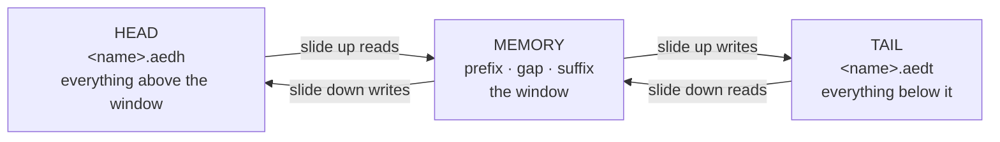

# A document larger than memory

AED holds its document in a gap buffer. A gap buffer is a fine thing on a
machine with room for the file; this one has 315 KB of heap and the file that
forced the question — `slow.asm`, an eZ80 assembly source of 428,851 bytes —
is larger than all the memory there is.

This document is about what changed to make that file editable, and what each
change had to preserve. [`DESIGN.md`](DESIGN.md) is the overview; this is the
one subsystem in full.

## Contents

* [1. What follows from fixed memory](#1-what-follows-from-fixed-memory)
* [2. The shape](#2-the-shape)
* [3. Margins, and why not exhaustion](#3-margins-and-why-not-exhaustion)
* [4. A slide](#4-a-slide)
    * [4a. Down](#4a-down)
    * [4b. Up](#4b-up)
    * [4c. What a slide must not do](#4c-what-a-slide-must-not-do)
* [5. The index bounds the window](#5-the-index-bounds-the-window)
* [6. Line numbers across the boundary](#6-line-numbers-across-the-boundary)
* [7. Reading outside the window](#7-reading-outside-the-window)
* [8. The limits, and where each comes from](#8-the-limits-and-where-each-comes-from)
* [9. How it is checked](#9-how-it-is-checked)

---

## 1. What follows from fixed memory

> Fixed memory and an unbounded file means the document lives on disk and RAM
> holds a fixed-size working set.

There is no data structure that escapes that. Raising the buffer buys a little
and then stops: the heap is the ceiling, and the ceiling is smaller than the
files people have. So it is paging, and the only real question is what makes
paging **not feel like paging** while you are typing.

The answer is in section 3. Everything else follows from one property, chosen
first and never given up:

> **Text on disk is never edited.** It is pushed and popped at the end facing
> memory, and nowhere else.

That is what keeps the disk side trivial. The store never has to find anything,
insert anything, or know what a line is. It hands back what it was given last.

## 2. The shape

The gap buffer is unchanged. It gained a disk backing on each side.



[`doc_store`](../src/doc_store.h#L69) owns the two scratch files and offers four
operations — push and pop at each end — plus a read for saving.
[`store_init`](../src/doc_store.c#L101) creates them;
[`store_head_push`](../src/doc_store.c#L217) and
[`store_tail_pop`](../src/doc_store.c#L254) are the pair a downward slide uses.

Two files rather than one, because the two ends grow independently and a single
file would need the middle moved every time either did.

TAIL carries [`STORE_HEADROOM`](../src/doc_store.h#L67) — 64 KB of dead space in
front of its text — so that text pushed back down has somewhere to go. That
space is written out at open rather than seeked over: on this platform, seeking
past the end of a file and writing there lands the write at the end instead,
which would put the document a headroom too early and lose that much off its far
end.

Both files stay open for as long as the document does. Opening one costs 1.12
centiseconds on MOS 3.0.2, and a slide would need two of them against less than
a millisecond for the 2 KB it actually moves.

## 3. Margins, and why not exhaustion

The obvious design ties I/O to exhaustion: memory fills, therefore flush. That
is wrong in a way worth naming, because it is the version most people write
first.

Exhaustion puts the disk boundary **exactly where the cursor is working**. A
cursor sitting on the edge and moving back and forth does a write and a read on
every keystroke.

So memory holds more than the cursor needs, and slides early:

```
  MEMORY
  ┌──────────────┬────────────────────────────┬──────────────┐
  │   margin     │   the cursor roams here    │   margin     │
  │   16 KB      │                            │   16 KB      │
  └──────────────┴────────────────────────────┴──────────────┘
         ▲                                            ▲
         └─ fewer than 16 KB above the cursor          └─ fewer below
            slide up                                      slide down
```

[`TB_MARGIN`](../src/text_buffer.h#L52) is 16 KB and
[`TB_CHUNK`](../src/text_buffer.h#L51) — how much one slide moves — is 2 KB, so
after a slide the cursor must travel 2 KB before it can cause another. That
hysteresis is the whole of what stops thrashing.

Both numbers are measured rather than chosen:

* **The chunk** is "about a frame to read and write". At the 182 KB/s the card
  was measured at, that lands between 1 and 2 KB. 2 KB is 22 ms of disk against
  the 40-odd ms a page-down already spends repainting sixty rows over the serial
  link — so a slide hides inside a repaint the user was paying for anyway.
* **The margin** has to cover a repaint, which spans about a screenful around
  the cursor. The widest mode is 128 × 96, so a dense screenful is 12 KB, and
  16 KB covers one with room over. That is what makes **painting free of disk by
  construction** rather than by hope.

[`tb_settle()`](../src/text_buffer_page.c#L125) is where a crossed margin is
noticed, and it slides until no margin is crossed.

**Settling picks one direction and holds it for the whole call.** Each side used
to be asked about its margin on its own, which is correct only while the window
is several margins wide — and section 5 is about how it often is not. When both
sides are under their margin at once, asking them separately makes settling
slide up, slide down, and undo itself until its guard runs out: ten slides a
keystroke with the window exactly where it started.

## 4. A slide

Whole lines, both directions. Memory then always holds complete lines, and
neither the index nor anything reading it needs a case for a line that straddles
the edge. The cost of that is a documented limit — section 8.

### 4a. Down

[`tb_slide_down()`](../src/text_buffer_page.c#L418): the front of memory goes to
HEAD, and a chunk comes back from TAIL.

1. Measure whole lines off the front, never the line the cursor is on.
2. Push them to HEAD. **Send before taking**, so the room it frees — in the
   index as much as in the buffer — is there to bring text into.
3. Pop from TAIL, split it into lines, append them.

The outgo is capped by what the tail can actually return. The cap the other way
round — no more comes in than went out — is the one people write first, and it
is only half of it. A tail holding ten bytes still had a whole 2 KB chunk
evicted against it, and the difference stayed in the head. Settling near the
bottom of a document made a pump out of that: 2,030 bytes left the window per
turn, and inside three cursor movements a 15,350-byte window held thirty bytes
with the document's other 199,960 in the head.

### 4b. Up

[`tb_slide_up()`](../src/text_buffer_page.c#L582) is the reverse, with two
asymmetries that are not obvious and both of which were bugs first.

**The trailing entry.** The index's last entry is the line that carries on past
memory, and it stays last. Taking an index entry off does not take its bytes
with it, and the trailing line's bytes are the *last* ones in memory — so
whatever goes out has to include them, or the bytes sent are part of the
trailing line and part of the last whole one, and what reaches the tail has no
break in it.

**The lookbehind byte.** A chunk taken off HEAD's end starts wherever the
arithmetic puts it, usually part way through a line, and those bytes belong to a
line whose start is still in HEAD. Sometimes it lands exactly on a boundary. The
two cases are **indistinguishable from the chunk alone**, so the slide reads one
byte in front of the run it wants: if that byte is the line feed, the run begins
a line. Without it, a chunk that landed on a boundary lost its first line every
time.

That byte is asked for **on top of** the chunk, not out of it — `slide_bytes` is
a byte over `TB_CHUNK` for exactly this. Taking it out of the chunk instead
meant a slide up could never carry a full chunk of text, so a line exactly
`TB_CHUNK` bytes long could go out of the window and never come back: the pop
returned a chunk, a byte went on lookbehind, and what was left was not a whole
line. The opener admits such a file — it looks for a break within a chunk and
finds one — so the document simply stopped scrolling upward, with no error
anywhere.

**Sliding up is deliberately not bounded by what HEAD can give back**, although
sliding down is bounded by TAIL. The symmetry is tempting and it costs: going
up, HEAD empties as the window climbs, so near the top of a file such a bound
stops anything going out, the window fills, and slides start failing. Measured
on `slow.asm`, it put 3,000 arrow-ups from 30 to 94 centiseconds. The leak that
bound was written for is in sliding down, and that is where it stayed.

### 4c. What a slide must not do

Four invariants, each of which has been broken and each of which failed quietly.

| | |
|---|---|
| **Memory must not grow** | or it bursts. The intake is bounded — [`refill_want`](../src/text_buffer_page.c#L405) — by what went out. |
| **Memory must not shrink** | or the window drains below its margins over many slides. Matching the outgo *exactly* is too tight: the run that comes back ends part way through a line and that tail is rewound, so a slide that takes exactly what it gave keeps half a line less. Twenty-four rounds of three thousand lines down and back took a 256 KB window from 188,178 bytes to 127,160. So a slide refills as well as moves, up to the reserve kept for the gap. |
| **No byte may be in two places** | or the document gains text. Everything taken is given back on every failure path, in the reverse order. |
| **No byte may be in neither** | or it loses text. This is the one the lookbehind byte protects. |

The first two are the pair that makes the difference: a slide is a *move*, and
the tests assert it by measuring the window before and after.

## 5. The index bounds the window

This is the part that surprised the design.

[`line_buffer`](../src/line_buffer.h#L25) holds one length per line, and
`tb_init` gives it `mem_kb × 32` slots against `mem_kb × 992` bytes of text —
about one slot per 31 bytes. At the shipped 72 KB that is **2,304 slots and
71,424 bytes**.

A document of ten-byte lines therefore fills the index after 23,040 bytes, and
the window is **narrower than two margins** whatever the buffer's size. Both
sides are then under their margin at once and always will be.

So: **the index bounds the window before the buffer does, whenever lines are
short**, and every piece of paging has to hold at that size rather than at the
buffer's. Sending text out is also how slots are freed, which is why a downward
slide evicts even when the tail can return nothing — otherwise a document of
short lines could not slide at all.

## 6. Line numbers across the boundary

A position is a line of the **document**, and when only a window is in memory
two counters make up the difference:

    tb_ypos  =  head_lines_ + (lines above the cursor in memory) + 1
    tb_ymax  =  head_lines_ + (lines in memory) + tail_lines_

Both are maintained by the slides, so neither needs a scan. Getting this wrong
is subtle and quiet — a line number one out reads a neighbouring line and looks
almost right — so it was built and tested against `tb_set_offscreen` before
there was anything on disk to count.

## 7. Reading outside the window

Two mechanisms, and which one applies is a question about writing.

**A walker** — `tb_copy` — shares the original's buffers and **owns nothing**.
Painting uses walkers, and painting only ever wants what is on screen, so a
walker must not slide: moving the window under the cursor that owns it would
turn a repaint into a scroll. Everything that would write refuses on the walker
flag, `tb_destroy` included, which would otherwise hand the original's memory
back while the cursor that owns it is still reading.

**Streaming** is for everything that has to see text outside the window.
[`tbi_doc_stream()`](../src/text_buffer_io.c#L749) walks HEAD, then memory, then
what is left of TAIL, feeding a sink. It reads only, so the window and the
cursor stay where they are. Saving, searching, and measuring or copying a range
all go through it.

Ranges stream **whatever the document's size**. The in-memory walk they replaced
was wrong on ordinary files too, and its answer depended on where the cursor
happened to be sitting: a select-all copy once returned 37% of a document with
nothing noticing.

Deleting a range is the exception. It is a mutation, so it settles as it goes.

## 8. The limits, and where each comes from

| limit | value | why |
|---|---|---|
| longest line | under `TB_CHUNK` | a slide moves whole lines, so a line that does not fit in a chunk can never be brought in |
| largest file | 8 MB | `objsize` is 32 bits and this machine's `int` is 24, so a larger file narrows to a small or negative number and walks past a signed comparison |
| open documents | one | the store is per document; a second would cost a second pair of scratch files and a second window |

The long-line check is at the front of the file, in
[`tb_open`](../src/text_buffer_io.c#L606), because everything after it discards
what is on screen and a file that cannot be opened must leave the editor as it
was. [`tb_load`](../src/text_buffer_io.c#L471) has nothing to lose, so it checks
after the load instead.

## 9. How it is checked

`test/test_paging.c` is the bulk of it, and three habits in it are worth
copying:

* **An oracle has to be something other than a second implementation.** A
  differential test of the range operations against the in-memory ones was tried
  first and does not work, because those were themselves wrong. The tests work
  their answers out from prefix sums.
* **Sweep the boundary rather than picking cases at it.** Which path a slide
  takes depends on where a 2 KB boundary fell relative to a line break.
  Hand-picked boundary cases missed most of it — five separate mutants survived,
  and one guard was masking another. The tests now sweep line widths and range
  ends across the boundary. The chunk-length line in section 4b was found by
  such a sweep: it needs a document whose lines are all exactly 2,048 bytes,
  which no hand-picked case had thought to build.
* **Assert the invariant, not the symptom.** "Memory did not grow" and "the
  document is the same length" catch a class of fault; "line 3 reads `three`"
  catches one fault.
